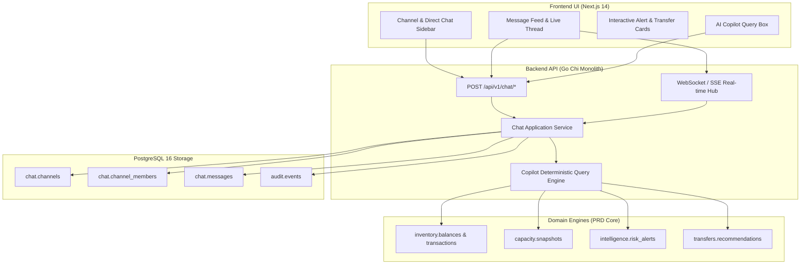

# EPIC: ArogyaGrid Operational Collaboration & AI Resource Copilot Chat System

> **Epic Code:** `EPIC-CHAT-01`  
> **Epic Name:** Operational Collaboration & AI Resource Copilot Chat System  
> **PRD Source:** [ArogyaGrid_Detailed_PRD.docx](file:///home/sarthaktripathy/Documents/Arogya/ArogyaGrid_Detailed_PRD.docx) (Sections 2.2, 4, 6, 7.1, 7.6, 9.5, 10.2, 11, 14, 15, 16, 23)  
> **Target Audience for this Epic:** Autonomous AI Coding Agent / Development Team  
> **Status:** `READY FOR IMPLEMENTATION`

---

## 1. Executive Summary & Problem Statement

### 1.1 The Problem (Directly Referencing PRD Section 2.2 & 2.3)
In public healthcare networks across Odisha (PHCs, CHCs, and District Hospitals), critical resource failures occur not because supplies don't exist, but because of **communication latency and unstructured coordination**:
* **PRD Failure Mode "Unstructured transfer":** *"Resources move by phone call / manual WhatsApp coordination without consistent rules. Poor auditability, delay, duplicate actions and unsafe donor depletion occur."*
* **PRD Failure Mode "Siloed facility data":** A Primary Health Center (e.g. Pipili PHC) faces a critical Oxytocin stockout while a nearby facility (e.g. Capital Hospital) has safe surplus, but facility managers have no structured, accountable channel to negotiate and coordinate.
* **PRD Failure Mode "Decision latency":** Healthcare officers must manually ask around for bed vacancies, blood unit availability, or medicine stock instead of getting instant, explainable answers from a unified decision layer.

### 1.2 The Solution
This Epic delivers an **integrated Operational Chat and AI Resource Copilot** native to ArogyaGrid that enables:
1. **Role-Scoped Healthcare Channels:** Dedicated communication channels for Facilities (`#pipili-phc`), District Coordination (`#khurda-district-emergency`), and direct peer-to-peer discussions between Facility Managers and District Health Officers.
2. **Contextual Transfer Threads:** Chat threads directly anchored to specific Transfer Orders and Work Items (`transfer_id`), eliminating fragmented phone calls and preserving a 100% auditable record of transfer negotiations.
3. **Interactive Operational Cards:** Live widgets inside chat for Stockout Alerts, Bed Capacity Stress, and Transfer Recommendations with 1-click approval actions.
4. **ArogyaGrid AI Operational Copilot:** An intelligent assistant inside the chat that answers natural language questions using live database queries (current stock, days of cover, safe surplus, donor rankings, bed occupancy) in accordance with PRD Section 23 (*"Inventory arithmetic and risk must be deterministic and explainable"*).

---

## 2. Architecture & PRD Alignment

### PRD Module Mapping

| PRD Section | PRD Requirement | Chat Implementation Feature |
| :--- | :--- | :--- |
| **Section 4 (Personas)** | Facility Manager, District Officer, State Admin, Logistics Officer | Role-based channel participation and role badges in message feed |
| **Section 7.1 & 16 (Auth & RBAC)** | Scoped permissions, token auth | Users can only access channels for their assigned facility/district unless Admin |
| **Section 7.6 (Alerts)** | Do not bury alerts inside generic UI | Alerts can be shared directly into relevant chat channels as actionable cards |
| **Section 9.5 (Transfer State)** | Transfer execution state machine | Chat messages anchor to `transfer_id`, dispatch/receive events emit system chat updates |
| **Section 14 (Database)** | PostgreSQL schema isolation | New `chat` schema (`chat.channels`, `chat.channel_members`, `chat.messages`) |
| **Section 17 (Privacy)** | No patient PII; aggregate data only | Strict sanitization guardrails: Chat messages store operational data only |
| **Section 23 (Non-Goals)** | Deterministic calculations, no hallucinated inventory | Copilot queries deterministic SQL metrics (days-of-cover, safe surplus formula) |

---

## 3. MVP Scope & Boundaries

### In Scope (P0 — Must Build)
* **PostgreSQL Schema:** `chat.channels`, `chat.channel_members`, `chat.messages`, `chat.message_cards`.
* **Channel Types:**
  * `FACILITY`: Internal facility team channel.
  * `DISTRICT`: District-wide emergency and resource coordination channel.
  * `TRANSFER_CONTEXT`: Thread attached to a specific transfer recommendation.
  * `DIRECT`: 1-on-1 direct message between two registered healthcare staff.
  * `COPILOT`: Dedicated 1-on-1 channel with the ArogyaGrid AI Assistant.
* **Go Backend API:** REST endpoints for creating channels, listing channels, sending messages, fetching message history, and marking messages as read.
* **Real-Time Delivery:** WebSocket connection hub (with fallback to resilient HTTP polling) for instant incoming messages.
* **AI Resource Copilot Engine:** Query processor that translates natural language questions into deterministic database queries (stock, days of cover, bed capacity, donor search) and responds with formatted markdown and actionable cards.
* **Next.js Frontend:** Full responsive Chat interface integrated into the ArogyaGrid web application with channel sidebar, active conversation feed, markdown message rendering, and role badges.
* **Interactive Message Cards:** Specialized card rendering in chat for:
  * `StockoutAlertCard` (Medicine, severity, days of cover, target facility)
  * `TransferRecommendationCard` (Source donor, destination, quantity, 1-click approve button)

### Out of Scope (Non-Goals for MVP)
* End-to-end signal protocol voice/video calling (WebRTC is P2).
* Multimedia audio note recording (text and structured data cards only).
* External WhatsApp/Telegram bridges (P2 integration).
* Unbounded AI generative medical diagnosis (strictly prohibited by PRD Section 3.3).

---

## 4. Definition of Done (DoD)

1. Database migration `002_chat_schema.sql` creates `chat` schema, tables, and indexes cleanly in PostgreSQL.
2. Go Chi router exposes `/api/v1/chat/*` endpoints with full JWT auth and RBAC enforcement.
3. Healthcare operators can send and receive messages in real-time across channels.
4. An operator can ask the AI Copilot: *"What is the stock of Oxytocin in Pipili PHC?"* and receive the exact, verified stock balance and days of cover.
5. Transfer approval events automatically post a confirmation card into the associated transfer chat thread.
6. All unit tests (`internal/chat/...`) pass with 100% green status.
7. Next.js web interface compiles with `npm run build` without TypeScript errors and is accessible at `/chat`.
